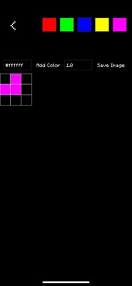

# 🎮 Gioco

**Gioco** is a no-code/low-code mobile-app game development platform that empowers anyone to turn their creative ideas into playable games. Whether you're a beginner with no coding experience or a developer looking to prototype quickly, Gioco lets you bring your game concepts to life using images, sounds, and simple logic—without writing thousands of lines of code.

## Features

- **Drag & Drop Interface** – Build games visually using images, buttons, audio, and interactions.
- **Custom Sprites & Tiles** – Import your own characters, backgrounds, and items.
- **Real-time Game Logic** – Define rules and behaviors with intuitive controls.
- **Sound Integration** – Add sound effects and music to enhance the experience.
- **Firebase Integration** – Upload and store assets securely in the cloud.
- **Game Servers** – Host multiplayer pixel games with real-time sync
- **Global & Room Chat** – Chat with others in lobbies or during games
- **Pixel Art Editor** – Frame-by-frame sprite editor with onion-skinning
- **Public Profiles** – Share games you've made, your achievements, and your favorites

## Getting Started

### start frontend
npx expo start

### start backend
cd backend
nodemon server.js

### dependencies
npm install

### expo latest 
npx expo install expo@latest

## Tech Stack

- **Frontend**: HTML, CSS, JavaScript (React)
- **Backend (Optional)**: Firebase for asset management, node.js, sqlite

## Example Use Cases

- Create a **Mario-style platformer** with custom levels and enemies.

## Future Plans

- Multiplayer support  
- AI-assisted level design  
- Community asset marketplace  

## Preview

  
  
  
  
  
  
  
  
  
  
  
  
  
  
  
  
  
  
  
  
  
  

## Contributing

Have ideas or want to help improve Gioco? Feel free to fork the repo and submit a pull request!

🧑‍💻 Created by 

**Malak Ahmed**  
Full-stack developer & cybersecurity enthusiast
(https://github.com/NADRA03)
